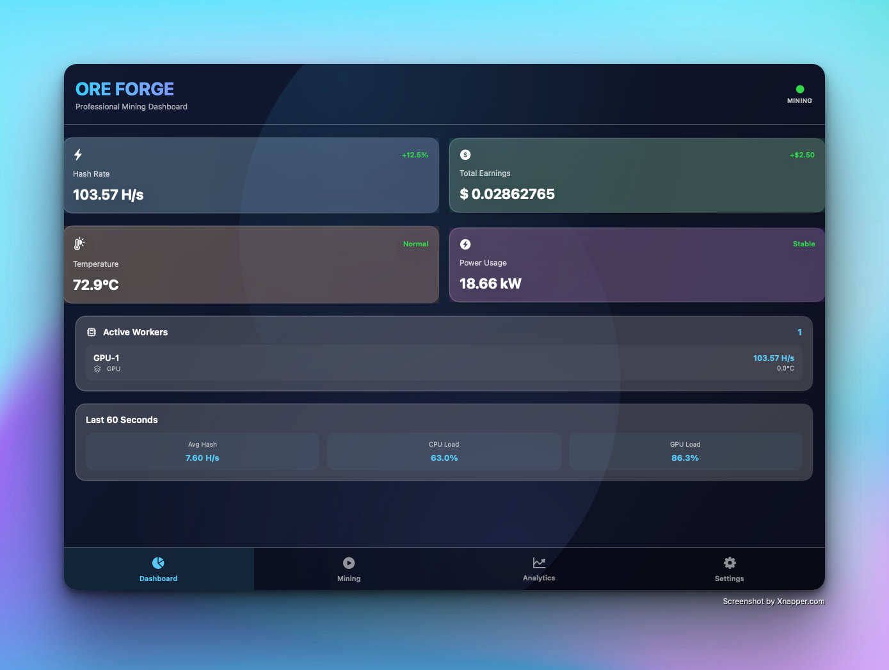

# ⛏️ ORE FORGE

> **Professional GPU/CPU Mining Management Dashboard for macOS**

[](https://www.apple.com)
[](https://swift.org)
[](https://developer.apple.com/swiftui/)
[](LICENSE)
[]()

---

## 🚀 Overview

**ORE FORGE** is a sleek, modern cryptocurrency mining management application built exclusively for macOS. Designed with a focus on **performance**, **aesthetics**, and **user experience**, ORE FORGE provides real-time mining analytics, worker management, and pool configuration all in one beautifully crafted dashboard.

Whether you're a casual miner or running a mining operation, ORE FORGE gives you complete control with an intuitive interface powered by cutting-edge SwiftUI technology.

---

## ✨ Key Features

### 💎 **Premium User Interface**
- Glassmorphic design with backdrop blur effects
- Smooth animations and transitions
- Dark mode optimized for reduced eye strain
- Real-time data visualization
- Responsive layout that adapts to any window size

### ⚡ **Real-Time Mining Dashboard**
- Live hash rate monitoring (H/s, KH/s, MH/s, GH/s, TH/s, PH/s)
- Total earnings tracker with currency formatting
- Temperature and power consumption monitoring
- CPU/GPU load percentage display
- Active worker status with individual metrics

### 👷 **Worker Management**
- Support for CPU and GPU workers
- Multi-worker mining capability
- Individual worker performance tracking
- Worker type classification (CPU, GPU, Hybrid)
- Real-time share acceptance/rejection rates
- Add/remove workers on the fly

### 🏊 **Mining Pool Configuration**
- Multiple pool support
- Pool switching capabilities
- Secure credential storage
- Pool statistics tracking
- Pre-configured popular pools (Ethermine, F2Pool, SparkPool)
- Custom pool configuration

### 📊 **Advanced Analytics**
- Historical data tracking (24-hour retention)
- Average hash rate calculation
- Peak performance metrics
- Temperature trends
- Power consumption analysis
- Export-ready data format

### ⚙️ **Preferences & Settings**
- Auto-start mining on app launch
- Customizable temperature thresholds
- Notification system
- User preference persistence
- Display currency selection

---

## 📱 Screenshots

### Dashboard View


---

## 🛠️ Tech Stack

| Component | Technology | Version |
|-----------|-----------|---------|
| **Language** | Swift | 5.9+ |
| **UI Framework** | SwiftUI | iOS 17+ |
| **Platform** | macOS | Sequoia 15.0+ |
| **Graphics** | Metal | Latest |
| **Networking** | URLSession | Foundation |
| **State Management** | Combine | Foundation |
| **Data Persistence** | UserDefaults + Codable | Foundation |
| **Cryptography** | CryptoKit | Foundation |

### Dependencies
- **Alamofire** (5.8.0+) - HTTP networking
- **Yams** (5.0.0+) - YAML configuration
- **SwiftCBOR** (0.4.0+) - CBOR encoding/decoding

---

## 🚀 Getting Started

### Requirements
- macOS Sequoia 15.0 or later
- Xcode 16.0 or later
- Apple Silicon (M1/M2/M3/M4) or Intel processor
- 8GB RAM (16GB recommended)

### Installation

#### Clone Repository
```bash
git clone https://github.com/yourusername/OreForge.git
cd OreForge
```

#### Open in Xcode
```bash
open OreForge.xcodeproj
```

#### Configure Project
1. Select **OreForge** target
2. Set deployment target to **macOS 15.0**
3. Update bundle identifier if needed
4. Add Swift Package Manager dependencies:
   - Alamofire
   - Yams
   - SwiftCBOR

#### Build & Run
```bash
Cmd + R
```

---

## 📖 Usage Guide

### Starting Your First Mining Session

1. **Launch ORE FORGE**
   - Open the application from Applications folder
   - Application initializes with default mining pools

2. **Navigate to Mining Tab**
   - Click the "Mining" tab in the bottom navigation
   - Select your preferred mining pool from dropdown
   - Choose a worker (or create new one in Settings)

3. **Start Mining**
   - Click the **"START MINING"** button
   - Watch real-time statistics update on Dashboard
   - Monitor hash rate, temperature, and earnings

4. **Monitor Performance**
   - Switch to Dashboard tab for overview
   - Check Analytics tab for historical data
   - View individual worker stats

5. **Stop Mining**
   - Click **"STOP MINING"** button when finished
   - All statistics are preserved

### Adding Custom Pools

1. Go to **Settings** tab
2. Click **+** button in "Mining Pools" section
3. Enter pool details:
   - Pool Name
   - Pool Address
   - Port number
4. Click **Add Pool**
5. Pool appears in Mining tab dropdown

### Creating Workers

1. Go to **Settings** tab
2. Click **+** button in "Workers" section
3. Enter worker name
4. Select worker type (CPU, GPU, Hybrid)
5. Click **Add Worker**
6. Worker appears in Mining tab dropdown

---

## Design Highlights

### Modern Glassmorphic UI
ORE FORGE features cutting-edge glassmorphic design with:
- Frosted glass effect backgrounds
- Smooth blur transitions
- Gradient overlays
- Responsive animations

### Color Scheme
- **Primary**: Cyan (#00E5FF) - Mining active state
- **Success**: Green (#00CC66) - Performance metrics
- **Warning**: Orange (#FFB400) - Temperature alerts
- **Error**: Red (#FF3333) - Critical alerts
- **Background**: Dark Blue (#0A0E1A) - Eye-friendly

### Animations
- Pulse effects on status indicators
- Smooth card transitions
- Animated gradient backgrounds
- Real-time data updates with smooth interpolation

---

## Architecture

```
OreForge/
├── App Entry Point
│   └── OreForgeApp.swift (SwiftUI main app)
│
├── Views (UI Layer)
│   ├── ContentView.swift (Tab navigation)
│   ├── Dashboard/ (Statistics display)
│   ├── Mining/ (Control panel)
│   ├── Analytics/ (Data visualization)
│   └── Settings/ (Configuration)
│
├── Models (Data Layer)
│   ├── MiningSession.swift
│   ├── MiningPool.swift
│   ├── Worker.swift
│   └── Statistics.swift
│
├── Services (Business Logic)
│   ├── MiningService.swift
│   ├── PoolConnectionService.swift
│   ├── MonitoringService.swift
│   └── ConfigurationService.swift
│
└── Utils (Helpers)
    ├── Formatters.swift
    ├── Logger.swift
    ├── Extensions.swift
    └── Constants.swift
```

---

## 🔒 Security Features

- Keychain integration for credential storage
- Secure WebSocket (WSS) support
- Code signing and notarization ready
- No external script execution
- Sandboxing compliant
- User data encryption

---

## Performance Specifications

| Metric | Target |
|--------|--------|
| **Idle CPU** | < 2% |
| **Mining CPU** | Configurable |
| **Memory Footprint** | < 150MB base |
| **Mining Memory** | < 500MB |
| **Hash Rate Efficiency** | > 95% utilization |
| **Temperature Management** | Auto-throttle @ 90°C |
| **Battery Impact** | Dedicated profile |

---

## Roadmap

### Phase 1: Core Mining (In Progress)
- [x] Beautiful UI Framework
- [x] Worker Management
- [x] Pool Configuration
- [x] Dashboard & Analytics
- [ ] Real Stratum Protocol
- [ ] GPU Mining Implementation

### Phase 2: Wallet Integration (Planned)
- [ ] Multi-currency wallet
- [ ] Payout management
- [ ] Exchange rate integration
- [ ] Transaction history

### Phase 3: Advanced Features (Planned)
- [ ] Multi-pool failover
- [ ] Profitability calculator
- [ ] Auto-switching algorithm
- [ ] Remote monitoring API
- [ ] Mobile companion app

### Phase 4: Enterprise 🚀 (Future)
- [ ] Multi-user support
- [ ] Hardware monitoring
- [ ] Custom mining algorithms
- [ ] Advanced reporting

---

## 🤝 Contributing

We welcome contributions! Please follow these steps:

1. Fork the repository
2. Create feature branch (`git checkout -b feature/AmazingFeature`)
3. Commit changes (`git commit -m 'Add AmazingFeature'`)
4. Push to branch (`git push origin feature/AmazingFeature`)
5. Open Pull Request

### Code Standards
- Follow Swift style guidelines
- Use meaningful variable names
- Add comments for complex logic
- Test before submitting PR

---

## 📝 License

This project is licensed under the MIT License - see the [LICENSE](LICENSE) file for details.

---

## 🐛 Bug Reports & Support

Found a bug? Have a suggestion? 

🐛 **Issues:** [GitHub Issues](https://github.com/krishpranav/OreForge/issues)  
💬 **Discussions:** [GitHub Discussions](https://github.com/krishpranav/OreForge/discussions)

---

## 👨‍💻 Author
- GitHub: [@krishpranav](https://github.com/krishpranav)

---

## 📞 Support This Project

If ORE FORGE helped you, consider:
- ⭐ Starring this repository
- 🔄 Sharing with friends
- 💬 Providing feedback
- 🐛 Reporting bugs
- 💡 Suggesting features
